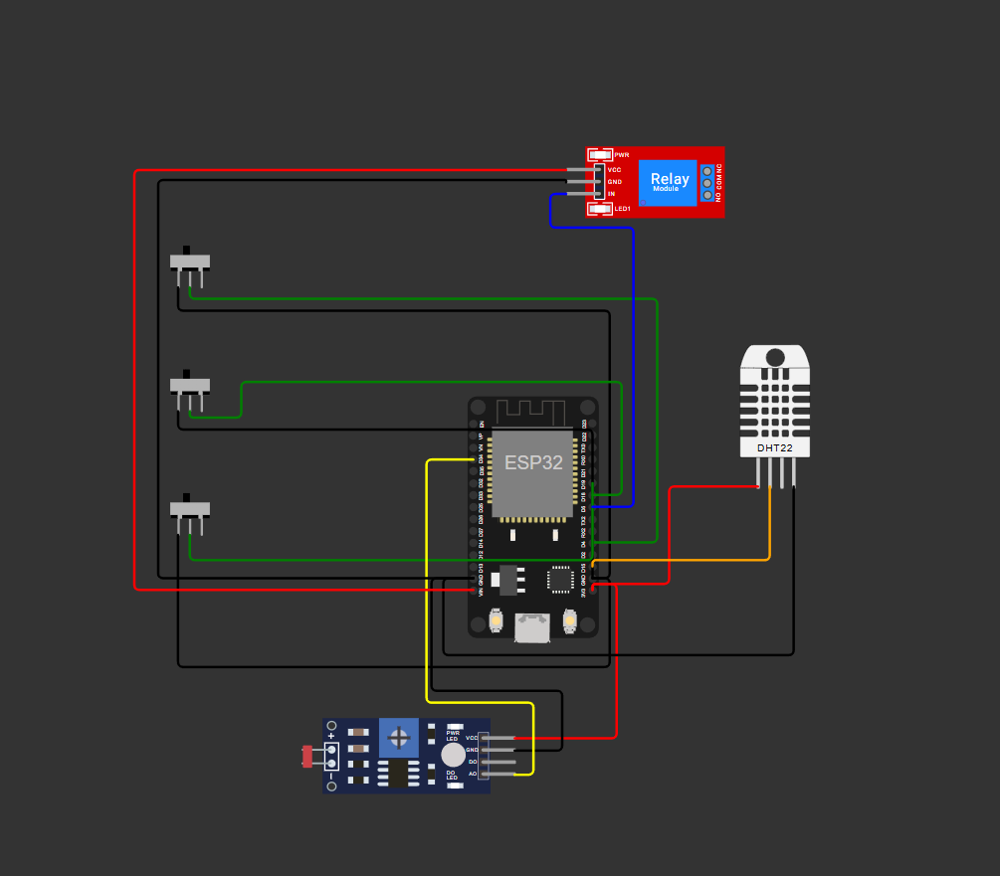
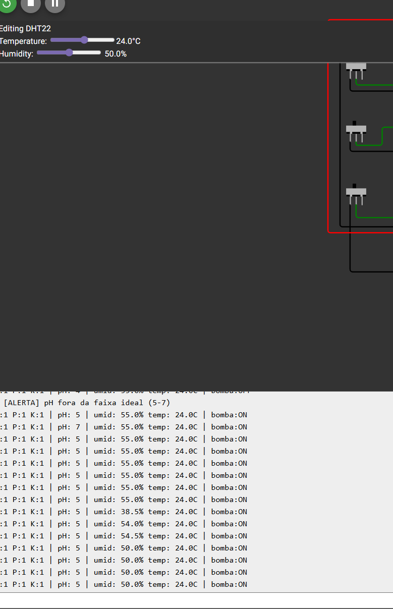
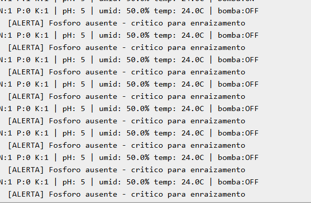
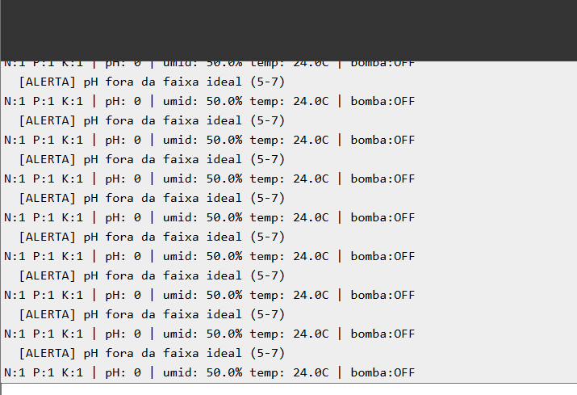

# FarmTech Solutions — Fase 2

## Sistema de Irrigação Inteligente para _Araucaria angustifolia_

Projeto IoT desenvolvido para a disciplina **Sistemas Embarcados** da FIAP. Um ESP32 monitora **nutrientes (NPK)**, **pH do solo** e **umidade**, e aciona automaticamente uma **bomba d'água** para irrigação de mudas de **araucária**, espécie nativa do sul do Brasil em risco de extinção.

🔗 Simulação completa: [wokwi.com/projects/461949583498181633](https://wokwi.com/projects/461949583498181633)

---

## 🌲 Por que Araucária?

A _Araucaria angustifolia_ (pinheiro-do-paraná) é símbolo da Mata Atlântica e está classificada como **criticamente em perigo** pela IUCN. O cultivo de mudas em viveiro exige controle rigoroso de umidade e nutrientes — é um caso de uso real para automação agrícola sustentável.

### Parâmetros agronômicos adotados

| Parâmetro                 | Faixa ideal                                   |
| ------------------------- | --------------------------------------------- |
| pH do solo                | **5 a 7** (levemente ácido)                   |
| Umidade do solo           | **60% a 75%**                                 |
| Nutriente crítico         | **Fósforo (P)** — essencial para enraizamento |
| Nutrientes complementares | Nitrogênio **OU** Potássio                    |

---

## 🔌 Hardware simulado

| Componente Wokwi                   | Pino ESP32     | Função no projeto                                     |
| ---------------------------------- | -------------- | ----------------------------------------------------- |
| `wokwi-slide-switch` × 3           | D4 / D18 / D19 | Sensores de **N, P, K** (ligado = nutriente presente) |
| `wokwi-photoresistor-sensor` (LDR) | D34 (ADC)      | Simula **sensor de pH** (0–14)                        |
| `wokwi-dht22`                      | D15            | **Umidade** e temperatura do solo                     |
| `wokwi-relay-module`               | D5             | Aciona a **bomba d'água**                             |
| `wokwi-esp32-devkit-v1`            | —              | Microcontrolador                                      |

> Os switches substituem os botões originais porque mantêm o estado entre cliques, permitindo simular a permanência de um nutriente no solo.

### Diagrama do circuito



---

## 🧠 Lógica de irrigação

A bomba **LIGA** apenas quando **TODAS** as condições abaixo são verdadeiras:

```
LIGA bomba SE:
    umidade < 60%             (solo seco)
  E pH ∈ [5, 7]               (acidez ideal para araucária)
  E umidade ≤ 75%             (não está encharcado)
  E Fósforo presente          (nutriente crítico)
  E (Nitrogênio OU Potássio)  (pelo menos um complementar)
```

### Alertas no Serial Monitor

| Condição       | Mensagem                                                 |
| -------------- | -------------------------------------------------------- |
| pH fora de 5–7 | `[ALERTA] pH fora da faixa ideal (5-7)`                  |
| Umidade > 75%  | `[ALERTA] Solo encharcado - risco de podridão radicular` |
| Sem fósforo    | `[ALERTA] Fósforo ausente - crítico para enraizamento`   |

---

## ▶️ Como executar

### Pré-requisitos

- Conta no [wokwi.com](https://wokwi.com)
- Licença Wokwi (Hobby gratuita serve)

### Passos

1. Acesse [wokwi.com](https://wokwi.com) → **New Project** → **ESP32**
2. Cole o conteúdo de [`sketch.ino`](sketch.ino) na aba do código
3. Cole o conteúdo de [`diagram.json`](diagram.json) na aba do diagrama
4. Abra **Library Manager** e adicione `DHTesp`
5. Clique em **▶ Play**

---

## 🧪 Cenários de teste

### 🟢 Cenário A — Irrigação ativada (condições ideais)

**Descrição:** Solo seco (50% de umidade), pH dentro da faixa ideal para a araucária, e nutrientes presentes (P + N + K). O sistema identifica que a planta precisa de água e que as condições são adequadas, então **liga a bomba**.

**Configuração:**

- Switches: N=on, P=on, K=on
- DHT22 umidade: 50%
- LDR ajustado para pH entre 5 e 7

**Saída no terminal:**

```
N:1 P:1 K:1 | pH: 5 | umid: 50.0% temp: 24.0C | bomba:ON
N:1 P:1 K:1 | pH: 5 | umid: 50.0% temp: 24.0C | bomba:ON
N:1 P:1 K:1 | pH: 5 | umid: 50.0% temp: 24.0C | bomba:ON
```




---

### 🔴 Cenário B — Fósforo ausente

**Descrição:** Mesmo com solo seco e pH adequado, a falta do **fósforo** (nutriente crítico para o enraizamento da araucária) impede a irrigação. Não adianta regar se a planta não terá como absorver os nutrientes essenciais para se desenvolver.

**Configuração:**

- Switches: N=on, **P=off**, K=on
- DHT22 umidade: 50%
- LDR ajustado para pH 5–7

**Saída no terminal:**

```
N:1 P:0 K:1 | pH: 5 | umid: 50.0% temp: 24.0C | bomba:OFF
  [ALERTA] Fosforo ausente - critico para enraizamento
N:1 P:0 K:1 | pH: 5 | umid: 50.0% temp: 24.0C | bomba:OFF
  [ALERTA] Fosforo ausente - critico para enraizamento
```



---

### 🔴 Cenário C — pH fora da faixa ideal

**Descrição:** O solo está seco e os nutrientes estão presentes, mas o **pH está fora do intervalo aceito pela araucária** (5 a 7). Solo muito ácido (pH<5) ou alcalino (pH>7) compromete a absorção de nutrientes — irrigar nessa condição seria inútil. O sistema desliga a bomba e dispara um alerta.

**Configuração:**

- Switches: N=on, P=on, K=on
- DHT22 umidade: 50%
- LDR no extremo (escuro = pH 0 ou claro máximo = pH 14)

**Saída no terminal:**

```
N:1 P:1 K:1 | pH: 0 | umid: 50.0% temp: 24.0C | bomba:OFF
  [ALERTA] pH fora da faixa ideal (5-7)
N:1 P:1 K:1 | pH: 0 | umid: 50.0% temp: 24.0C | bomba:OFF
  [ALERTA] pH fora da faixa ideal (5-7)
```



---

### 🔴 Cenário D — Solo encharcado

**Descrição:** A umidade do solo está acima de 75%, indicando **encharcamento**. A araucária é particularmente sensível ao excesso de água, que favorece _Phytophthora_ spp. e podridão radicular — principal causa de morte de mudas em viveiro. O sistema impede a irrigação adicional e alerta o usuário.

**Configuração:**

- Switches: N=on, P=on, K=on
- DHT22 umidade: 91%
- LDR ajustado para pH 5–7

**Saída no terminal:**

```
N:1 P:1 K:1 | pH: 5 | umid: 91.0% temp: 24.0C | bomba:OFF
  [ALERTA] Solo encharcado - risco de podridao radicular
N:1 P:1 K:1 | pH: 5 | umid: 91.

---

## 🧩 Entregas opcionais (Ir Além)

Além do sistema embarcado principal, o projeto inclui dois módulos complementares que estendem a decisão de irrigação para fora do ESP32:

- **Opcional 1** — script Python que consulta a API pública do **OpenWeather** e recomenda suspender a irrigação quando há previsão de chuva.
- **Opcional 2** — script R com **análise estatística** de dados simulados dos sensores (coeficiente de variação, correlação, regressão linear e regressão logística).

A integração com o ESP32 do Wokwi é **manual**: o simulador do Wokwi não acessa a internet, então o usuário roda os scripts no computador e repassa o resultado (um inteiro 0/1 no Serial Monitor, ou ajustando o código antes de rodar o sketch).

---

### 📡 Opcional 1 — Python + OpenWeather API

**Pasta:** [`opcional1_python/`](opcional1_python/) · **Script:** [`openweather_check.py`](opcional1_python/openweather_check.py)

Consulta a previsão de 5 dias / 3 horas do OpenWeather para **Curitiba/PR** (cidade de referência do viveiro), analisa as próximas 12 horas (configurável) e recomenda:

- **SUSPENDER** a irrigação se a probabilidade máxima de chuva (POP) for ≥ 50% **ou** o acumulado previsto for ≥ 1 mm;
- **PROSSEGUIR** caso contrário.

A saída inclui uma linha pronta para ser copiada no Serial Monitor do Wokwi:

```
CHUVA_PREVISTA=1  IRRIGAR_MANUAL=0  // SUSPENDER
```

#### Pré-requisitos

- Python 3.8+
- Conta gratuita no [OpenWeather](https://home.openweathermap.org/users/sign_up) e uma API key ativa (a chave costuma levar de 10 min a 2h para propagar após o cadastro)

> ⚠️ **Segurança:** a chave nunca é gravada no código — o script lê da variável de ambiente `OPENWEATHER_API_KEY`. Nunca faça commit da sua chave.

#### Como executar

```powershell
# Windows (PowerShell)
$env:OPENWEATHER_API_KEY = "sua_chave_aqui"
cd opcional1_python
python openweather_check.py "Curitiba,BR"
```

```bash
# Linux / macOS
export OPENWEATHER_API_KEY="sua_chave_aqui"
cd opcional1_python
python3 openweather_check.py "Curitiba,BR"
```

Argumentos opcionais:

- `cidade` — no formato `"Nome,PaisISO"` (padrão: `Curitiba,BR`)
- `--horas N` — janela em horas para checar chuva (padrão: 12)

O script usa apenas a biblioteca padrão do Python (`urllib`, `json`, `argparse`) — sem dependências externas para instalar.

---

### 📊 Opcional 2 — Análise estatística em R

**Pasta:** [`opcional2_r/`](opcional2_r/) · **Script:** [`analise_irrigacao.R`](opcional2_r/analise_irrigacao.R) · **Dados:** [`dados_sensores.csv`](opcional2_r/dados_sensores.csv)

Script em R que processa 25 linhas simuladas de leituras dos sensores e produz uma análise estatística completa da base, alinhada à mesma regra de irrigação do `sketch.ino`.

#### Dataset (`dados_sensores.csv`)

25 registros com as colunas:

| Coluna    | Tipo     | Descrição                                |
| --------- | -------- | ---------------------------------------- |
| `umidade` | numérico | Umidade do solo (%)                      |
| `ph`      | inteiro  | pH do solo (0–14)                        |
| `n`       | 0/1      | Nitrogênio presente                      |
| `p`       | 0/1      | Fósforo presente (nutriente crítico)     |
| `k`       | 0/1      | Potássio presente                        |
| `irrigou` | 0/1      | Decisão da bomba (rótulo)                |

Os rótulos foram gerados aplicando exatamente a regra do ESP32 — 10 registros com `irrigou=1` e 15 com `irrigou=0`, com variação em todos os cenários possíveis (solo seco, encharcado, pH fora da faixa, fósforo ausente etc.).

#### Técnicas aplicadas

1. **Estatística descritiva** — `summary()` com quartis, média, mediana e extremos por coluna.
2. **Coeficiente de variação (CV)** — cobrado pela disciplina de R da FIAP. Resultado esperado: umidade ≈ 25,7% (média dispersão), pH ≈ 20,4% (média dispersão), variáveis binárias > 30% (alta dispersão — comportamento esperado para 0/1).
3. **Matriz de correlação de Pearson** — com interpretação automática da força (muito fraca / fraca / moderada / forte / muito forte).
4. **Regressão linear simples** — `lm(umidade ~ ph)` como exemplo pedagógico da técnica exigida pela FIAP; imprime a equação e o R².
5. **Regressão logística** — `glm(irrigou ~ umidade + ph + n + p + k, family = binomial)` como modelo de decisão binária; inclui matriz de confusão, acurácia e odds ratios.

Além dos resultados no console, o script salva **3 gráficos PNG** na pasta:

- `grafico_boxplot_umidade.png` — umidade por decisão de irrigação
- `grafico_cv.png` — coeficiente de variação por variável
- `grafico_scatter_umid_ph.png` — dispersão umidade × pH colorida por decisão

#### Pré-requisitos

- R 4.0 ou superior ([cran.r-project.org](https://cran.r-project.org/))
- Nenhum pacote externo — o script usa apenas **base R**

#### Como executar

```bash
cd opcional2_r
Rscript analise_irrigacao.R
```

Ou abrir o arquivo no **RStudio** e executar linha a linha.
