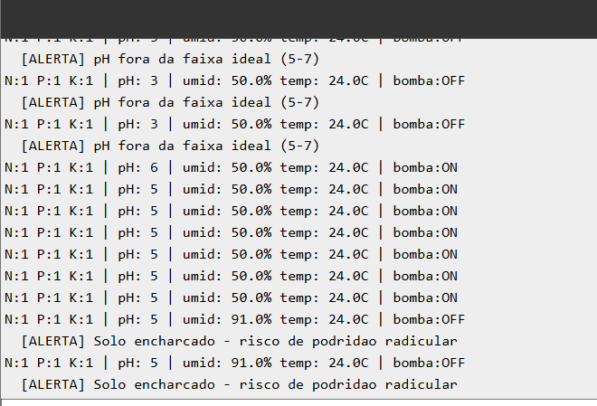

# FarmTech Solutions — Fase 2

## Sistema de Irrigação Inteligente para *Araucaria angustifolia*

Projeto IoT desenvolvido para a disciplina **Sistemas Embarcados** da FIAP. Um ESP32 monitora **nutrientes (NPK)**, **pH do solo** e **umidade**, e aciona automaticamente uma **bomba d'água** para irrigação de mudas de **araucária**, espécie nativa do sul do Brasil em risco de extinção.

🔗 Simulação completa: [wokwi.com/projects/461949583498181633](https://wokwi.com/projects/461949583498181633)

---

## 🌲 Por que Araucária?

A *Araucaria angustifolia* (pinheiro-do-paraná) é símbolo da Mata Atlântica e está classificada como **criticamente em perigo** pela IUCN. O cultivo de mudas em viveiro exige controle rigoroso de umidade e nutrientes — é um caso de uso real para automação agrícola sustentável.

### Parâmetros agronômicos adotados

| Parâmetro | Faixa ideal |
|-----------|-------------|
| pH do solo | **5 a 7** (levemente ácido) |
| Umidade do solo | **60% a 75%** |
| Nutriente crítico | **Fósforo (P)** — essencial para enraizamento |
| Nutrientes complementares | Nitrogênio **OU** Potássio |

---

## 🔌 Hardware simulado

| Componente Wokwi | Pino ESP32 | Função no projeto |
|------------------|------------|-------------------|
| `wokwi-slide-switch` × 3 | D4 / D18 / D19 | Sensores de **N, P, K** (ligado = nutriente presente) |
| `wokwi-photoresistor-sensor` (LDR) | D34 (ADC) | Simula **sensor de pH** (0–14) |
| `wokwi-dht22` | D15 | **Umidade** e temperatura do solo |
| `wokwi-relay-module` | D5 | Aciona a **bomba d'água** |
| `wokwi-esp32-devkit-v1` | — | Microcontrolador |

> Os switches substituem os botões originais porque mantêm o estado entre cliques, permitindo simular a permanência de um nutriente no solo.

### Diagrama do circuito


---

## 🧠 Lógica de irrigação

A bomba **LIGA** apenas quando **TODAS** as condições abaixo são verdadeiras:

```
LIGA bomba SE:
    umidade < 60%             (solo seco)
  E pH ∈ [5, 7]               (acidez ideal para araucária)
  E umidade ≤ 75%             (não está encharcado)
  E Fósforo presente          (nutriente crítico)
  E (Nitrogênio OU Potássio)  (pelo menos um complementar)
```

### Alertas no Serial Monitor

| Condição | Mensagem |
|----------|----------|
| pH fora de 5–7 | `[ALERTA] pH fora da faixa ideal (5-7)` |
| Umidade > 75% | `[ALERTA] Solo encharcado - risco de podridão radicular` |
| Sem fósforo | `[ALERTA] Fósforo ausente - crítico para enraizamento` |

---

## ▶️ Como executar

### Pré-requisitos
- Conta no [wokwi.com](https://wokwi.com)
- Licença Wokwi (Hobby gratuita serve)

### Passos

1. Acesse [wokwi.com](https://wokwi.com) → **New Project** → **ESP32**
2. Cole o conteúdo de [`sketch.ino`](sketch.ino) na aba do código
3. Cole o conteúdo de [`diagram.json`](diagram.json) na aba do diagrama
4. Abra **Library Manager** e adicione `DHTesp`
5. Clique em **▶ Play**

---

## 🧪 Cenários de teste

### 🟢 Cenário A — Irrigação ativada (condições ideais)

**Descrição:** Solo seco (50% de umidade), pH dentro da faixa ideal para a araucária, e nutrientes presentes (P + N + K). O sistema identifica que a planta precisa de água e que as condições são adequadas, então **liga a bomba**.

**Configuração:**
- Switches: N=on, P=on, K=on
- DHT22 umidade: 50%
- LDR ajustado para pH entre 5 e 7

**Saída no terminal:**
```
N:1 P:1 K:1 | pH: 5 | umid: 50.0% temp: 24.0C | bomba:ON
N:1 P:1 K:1 | pH: 5 | umid: 50.0% temp: 24.0C | bomba:ON
N:1 P:1 K:1 | pH: 5 | umid: 50.0% temp: 24.0C | bomba:ON
```


---

### 🔴 Cenário B — Fósforo ausente

**Descrição:** Mesmo com solo seco e pH adequado, a falta do **fósforo** (nutriente crítico para o enraizamento da araucária) impede a irrigação. Não adianta regar se a planta não terá como absorver os nutrientes essenciais para se desenvolver.

**Configuração:**
- Switches: N=on, **P=off**, K=on
- DHT22 umidade: 50%
- LDR ajustado para pH 5–7

**Saída no terminal:**
```
N:1 P:0 K:1 | pH: 5 | umid: 50.0% temp: 24.0C | bomba:OFF
  [ALERTA] Fosforo ausente - critico para enraizamento
N:1 P:0 K:1 | pH: 5 | umid: 50.0% temp: 24.0C | bomba:OFF
  [ALERTA] Fosforo ausente - critico para enraizamento
```


---

### 🔴 Cenário C — pH fora da faixa ideal

**Descrição:** O solo está seco e os nutrientes estão presentes, mas o **pH está fora do intervalo aceito pela araucária** (5 a 7). Solo muito ácido (pH<5) ou alcalino (pH>7) compromete a absorção de nutrientes — irrigar nessa condição seria inútil. O sistema desliga a bomba e dispara um alerta.

**Configuração:**
- Switches: N=on, P=on, K=on
- DHT22 umidade: 50%
- LDR no extremo (escuro = pH 0 ou claro máximo = pH 14)

**Saída no terminal:**
```
N:1 P:1 K:1 | pH: 0 | umid: 50.0% temp: 24.0C | bomba:OFF
  [ALERTA] pH fora da faixa ideal (5-7)
N:1 P:1 K:1 | pH: 0 | umid: 50.0% temp: 24.0C | bomba:OFF
  [ALERTA] pH fora da faixa ideal (5-7)
```


---

### 🔴 Cenário D — Solo encharcado

**Descrição:** A umidade do solo está acima de 75%, indicando **encharcamento**. A araucária é particularmente sensível ao excesso de água, que favorece *Phytophthora* spp. e podridão radicular — principal causa de morte de mudas em viveiro. O sistema impede a irrigação adicional e alerta o usuário.

**Configuração:**
- Switches: N=on, P=on, K=on
- DHT22 umidade: 91%
- LDR ajustado para pH 5–7

**Saída no terminal:**
```
N:1 P:1 K:1 | pH: 5 | umid: 91.0% temp: 24.0C | bomba:OFF
  [ALERTA] Solo encharcado - risco de podridao radicular
N:1 P:1 K:1 | pH: 5 | umid: 91.0% temp: 24.0C | bomba:OFF
  [ALERTA] Solo encharcado - risco de podridao radicular
```



---

## 📁 Estrutura do projeto

```
.
├── sketch.ino          # Firmware do ESP32
├── diagram.json        # Circuito do Wokwi
├── README.md
└── prints/             # Capturas dos cenários de teste
    ├── sistemacompleto.png
    ├── cenario_A_bomba_on.png.png
    ├── cenario_B_fosforo.png.png
    ├── cenario_C_ph.png.png
    └── cenario_D_encharcado.png.png
```

---

## 👥 Equipe

Trabalho desenvolvido para a **FIAP — Inteligência Artificial / Fase 2**.
Cap. *FarmTech Solutions: da Visão à Implementação*.
